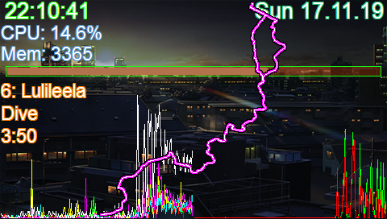
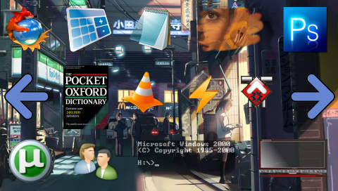
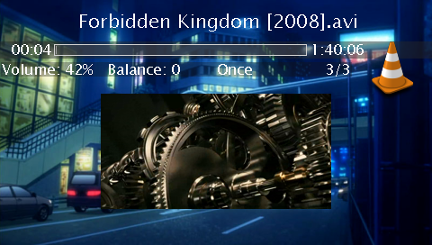
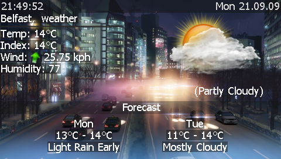
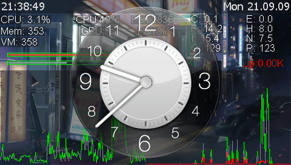
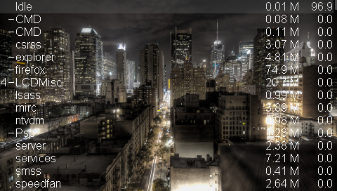
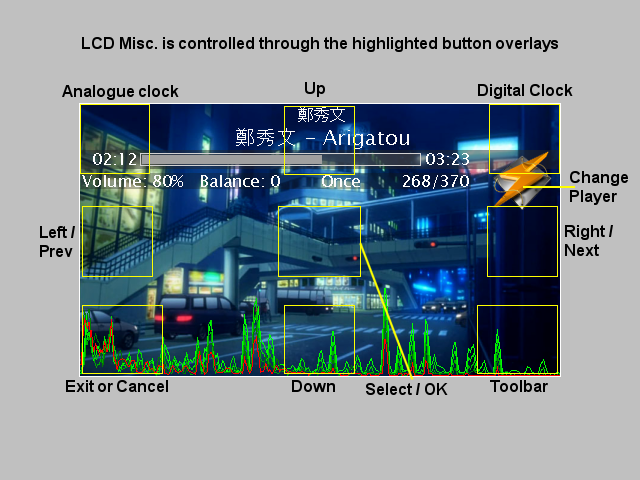

LCD Miscellany 0.4.6  
LCD Miscellany is a tool allowing one to write scripts to display stuff on external displays or as desktop windows  
  

Changes:  

Added Device Arrive and Depart notification event ("DeviceChange"). Useful to detect when a usb device is inserted/removed.  
Added experimental serial port access via "ComPort" object.  
Added a Garmin Traianing Center datafile parser class (.tcx files).  
Modified GetTickCount/NoOverflow() to use GetTickCount64()  
Added IsImage(obj) and IsImage32(obj)  
Added SetForegroundWindow(hWnd) and ShowWindow((hWnd, SW_ )  
Added GetFocussedProcess(). Returns filepath of topmost window.  
Added IsAdmin(). Returns true if current user is a local administrator.  
Added GetDesktopInfo(). Returns a list containing width, height, bpp and hz.  
Added Is64Bit(flags). Returns whether operating system or LCDMisc is 64bit (flags:Is64Bit_OS and Is64Bit_LCDMISC)  
Added GetPowerStatus(). Returns a list containing SYSTEM_POWER_STATUS  
Added SaveSnapshot(path)  
Added Drive & Media change notification events ("DriveChange"). Sent upon on storage media insertion or removal  
Added GetChar(), Suspend(), Shutdown(), AbortShutdown() and LockSystem() to the HTML documents.  
Fixed a tokenizer bug with out of bounds access when processing "|x####" strings  
Added Load support for .PSD bitmap images  
Image32's may now be drawn on to other images  
Expanded Image32 class, adding Fade(), Draw(), Clear(), Copy(), Blur(), FLip() and Pixelize().  
Added NewImage32()  
Removed font size limitation  
Removed intrinsic support for Logitech devices. They may be added through a plugin (but not by me).  
Fixed image loading with absolute paths'  
Added example App. launcher view/script based upon the app launcher class.  
Added an icon based application launcher class.  
OVerhauled all graphics and script view layouts to better suit larger colour displays.  
Added Button and Icon classes.  
Created a Code::Blocks project file for use with MinGW32/64  

From LCDMisc. 4.5.0  
LCDMisc. for the SwitchBlade SBUI by Michael McElligott  

From LCDMisc. 4.4.0  
LCDMisc. for the USBD480  
LCDMisc for the USBD480 is a customization of the LCDMisc v4.4.3 scripts; adding an output plugin, touch panel control, full colour and resolution support for the USBD480, along with additional views and graphics.  

LCDMisc. 4.4.0  
LCD Misc. is written & (c) by Matt Menke.  
Original project page: http://code.google.com/p/lcdmiscellany/  

